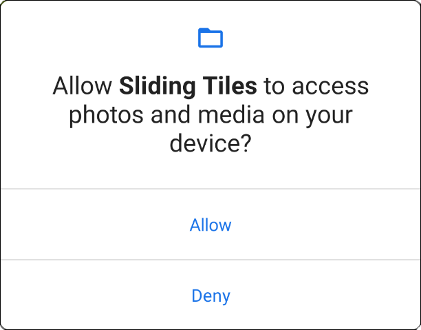

## What is it?

**Sliding tiles** is an Android implementation of the classic [_sliding puzzle_](https://en.wikipedia.org/wiki/Sliding_puzzle), or [_15 puzzle_](https://en.wikipedia.org/wiki/15_puzzle). It extends the basic forms of those puzzles in 3 main areas:

* The number of tiles can be set by the user at 8, 15, 24, or 25 (3x3, 4x4, 5x5, or 6x6, respectively, with 1 open space).

* The user can select 1 of 3 included images, or any image from the Android image gallery (e.g. downloaded images, or images captured by the device camera). The puzzle tiles are formed by slices of this image; when the puzzle is solved, the complete image will be shown.

* A timer and move counter are updated as the puzzle is being solved. Thus, the user may take as their objective simply solving the puzzle, or solving the puzzle in as few moves as possible, or solving it in the least amount of time possible.  

## Who is it for?

A 3x3 or 4x4 puzzle can usually be completed in a few minutes; thus, _Sliding Tiles_ is perfect for anyone needing a quick break or distraction. Because it also exercises logical and spatial reasoning, as well as pattern recognition, it can be challenging and intellectually rewarding for those looking to practice those abilities.

Apart from our intent that _Sliding Tiles_ should be a fun and interesting puzzle, the app is primarily intended for use in a curriculum unit of the [Deep Dive Coding](https://deepdivecoding.com/) [Java + Android bootcamp](https://deepdivecoding.com/java-android/). Through development and refinement of this app, students will explore the use of activities, fragments, navigation &amp; options menus, adapter views &amp; adapters, settings/preferences, viewmodels &amp; LiveData, persistence via SQLite with Room, etc.

## How do I use it?

### Launch

* Start the app by launching the **Sliding Tiles** icon. 

* If this is the first time the app is launched after installation, a request for permission to access images on the device appears. Note that this access is not required to run the app; however, granting this access does allow you to select a puzzle image other than the 3 included with the app.  

### Play

* After the access permission request is accepted (or declined), the main screen of the app appears, with a new puzzle started immediately. If this is the first time running the app after installation, a default image (one of the Android robot image variants) is used, with a puzzle size of 4x4.  

* To move a tile that's adjacent to the empty space into that space, simply click on it. (There's no need to drag the tiles to move them.) If you click on a tile that's not adjacent to the empty space, a message indicating that the tile you clicked can't be moved will appear briefly at the bottom of the screen.

* After any tile is moved, the move counter increases.

* The timer updates automatically until the puzzle is solved.

* When the puzzle is solved, you'll see a message to that effect at the bottom of the screen. The entire unscrambled image will be displayed, without any separations between the tiles. No tiles may be moved in a solved puzzle.

* At any time, you may reset the puzzle to its original (scrambled) position by clicking the **Reset** button.

* To start a new puzzle (with the current settings) in a new, scrambled configuration, click the **New** button.

### Settings  

To review or change app settings, select **Settings** from the options overflow menu (usually accessed by clicking the 3 vertical dots in the upper-right corner of the screen).

* Tile slide animation can be enabled or disabled with the **Tile slide animation** switch. Changing this settings takes effect immediately on returning to the puzzle screen.

* The **Puzzle size** slider can be set to 3, 4, 5, or 6, for a resulting size of 3x3, 4x4, 5x5, or 6x6 (respectively). Any changes to this setting take effect when the next new puzzle is created.

* Clicking **Puzzle image** displays a list of images, including the 3 images included with the app, along with the currently selected image (if it's not one of the default 3).
    
    If permission to access external images was previously granted, a **Browse gallery** option is displayed. After clicking this image, you'll be presented with a standard dialog for browsing and selecting the image files on the device. 
  
    Changing the selected image will take effect immediately on return to the puzzle screen.   

## Credits

_Sliding Tiles_ was written by Nick Bennett, with Chris Hughes and Steven Z&uacute;&ntilde;iga.

Copyright 2020 Deep Dive Coding/CNM Ingenuity, Inc.

Licensed under the Apache License, Version 2.0 (the "License");
you may not use this file except in compliance with the License.
You may obtain a copy of the License at

<http://www.apache.org/licenses/LICENSE-2.0>

Unless required by applicable law or agreed to in writing, software
distributed under the License is distributed on an "AS IS" BASIS,
WITHOUT WARRANTIES OR CONDITIONS OF ANY KIND, either express or implied.
See the License for the specific language governing permissions and
limitations under the License.

For copyright &amp; license information on the libraries incorporated into _Sliding Tiles_, see [Notice](notice.md).